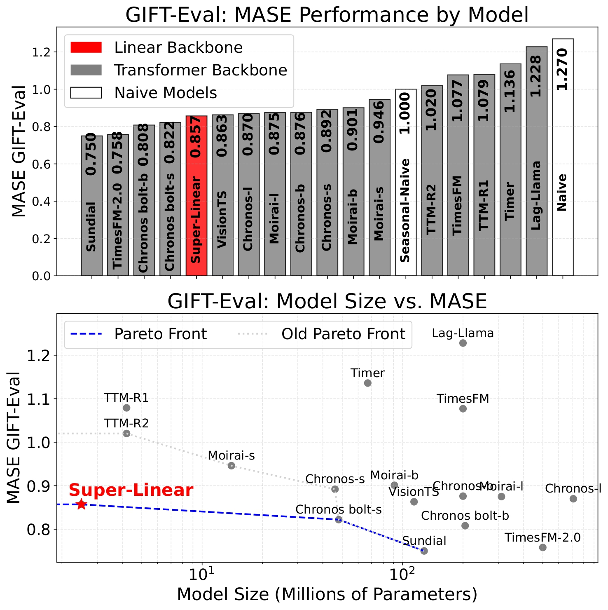
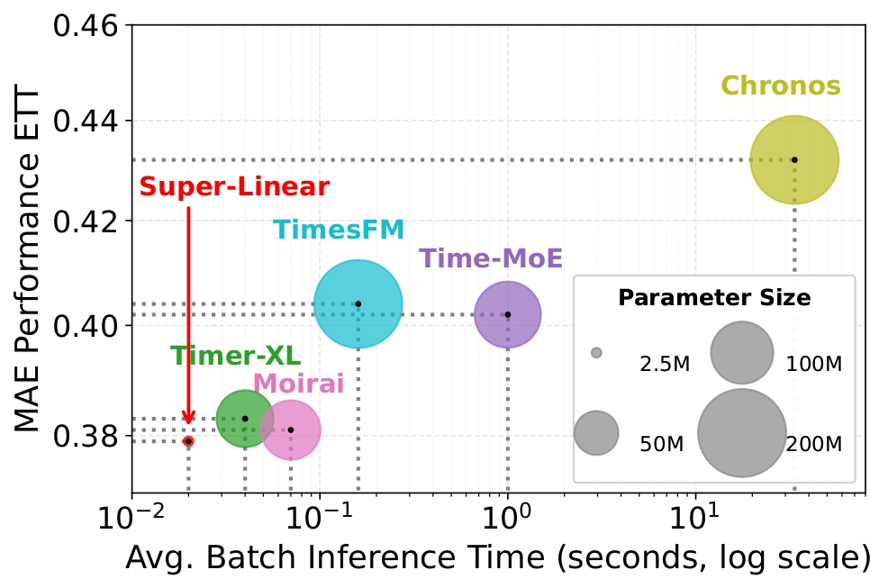

<div align="center">
  <h2><b>Super-Linear: A Lightweight Pretrained Mixture of Linear Experts for Time Series Forecasting</b></h2>
</div>

<div align="center">
  
[](https://opensource.org/licenses/MIT)


</div>

<div align="center">
  
**[<a href="https://github.com/azencot-group/SuperLinear">GitHub</a>]**
**[<a href="https://huggingface.co/SequentialLearning/SuperLinear">Hugging Face</a>]**
**[<a href="https://arxiv.org/abs/2509.15105">Paper</a>]**
</div>

<p align="center">
  
</p>

> Super Linear provides a **comprehensive foundation** for time series forecasting achieveing competitive performance against more complex models
with an efficient architecture combine mixture of frequencies linears experts.

## Updates/News:

🚩 **News** (September 2025): Super Linear v1.0.0 has been released!


## Result Snapshot 🔬
Super-Linear delivers competitive, and in some cases surpassing , state-of-the-art Transformer models, all while using a simple linear backbone with just **2.5M** parameters!

<p align="center">
  
  
</p>


## Getting Started 🚀 

### Installation

1. Clone the repository
```bash
pip install -r requirements.txt
```

## Making Forecasts (Hugging Face) 📈 
```typescript
import torch
from transformers import AutoModelForCausalLM

model_path = "./model_files/" # local
model_path = "SequentialLearning/SuperLinear" # hugging_face
model = AutoModelForCausalLM.from_pretrained(model_path,trust_remote_code=True, force_download=True)

seq_len = 512
pred_len = 96

freq = 1/24
amp = 1
ph = 0

t = torch.arange(0, seq_len+ pred_len)
s = amp * torch.sin(2 * np.pi * freq * t + ph)
x = s[:seq_len].unsqueeze(0)  # Add batch dim
y = s[seq_len:].unsqueeze(0)  # Add batch dim

with torch.no_grad():
    # takes shapes (B, V, L) or (B, L)
    output = model(x, pred_len=pred_len, get_prob=True)
    preds = output.logits # Predicted values
    probs = output.attentions  # Expert probabilities stored here
expert_names = model.backbone.experts.keys()

```


### Data Preparation

You can obtain all the benchmarks from [Google Drive](https://drive.google.com/drive/folders/1ZOYpTUa82_jCcxIdTmyr0LXQfvaM9vIy) provided in Autoformer. All the datasets are well pre-processed and can be used easily.

```
mkdir dataset
```
**Please put them in the `./dataset` directory**

## Evaluation 📐

+ [Example] Running the follow command to evaluate on ETTh1 with prediciton horizon 96

```shell
python run_eval.py -d dataset/ETT-small/ETTh1.csv -p 96
```

+ [Example] Running the follow command to evaluate on ETTh1 with prediciton horizon 720

```shell
python run_eval.py -d dataset/ETT-small/ETTh1.csv -p 720
```


+ [Example] Running the follow command to evaluate on weather with prediciton horizon 720

```shell
python run_eval.py -d dataset/weather/weather.csv -p 720
```


## Full-Shot, Few-Shot 🔥

In progress


## TODO ⏳

* Add Super-Linear to GIFT-Eval leaderboard. The results and notebook for GIFT-Eval can be found in the gift-eval directory.

## Citation📕

If you use SuperLinear in your research, please cite:

```bibtex
@article{nochumsohn2025super,
  title={Super-Linear: A Lightweight Pretrained Mixture of Linear Experts for Time Series Forecasting},
  author={Nochumsohn, Liran and Marshanski, Raz and Zisling, Hedi and Azencot, Omri},
  journal={arXiv preprint arXiv:2509.15105},
  year={2025}
}
```

## Resources 📄
* Are Transformers Effective for Time Series Forecasting? [\[paper\]](https://arxiv.org/abs/2205.13504) [\[GitHub Repo\]](https://github.com/cure-lab/LTSF-Linear)
* Mixture-of-Linear-Experts for Long-term Time Series Forecasting, in AISTATS 2024. [\[paper\]](https://arxiv.org/abs/2312.06786) [\[GitHub Repo\]](https://github.com/RogerNi/MoLE)
* A Multi-Task Learning Approach to Linear Multivariate Forecasting, in AISTATS 2025. [\[paper\]](https://arxiv.org/abs/2502.03571) [\[GitHub Repo\]](https://github.com/azencot-group/MTLinear)
* Time-MoE: Billion-Scale Time Series Foundation Models with Mixture of Experts, in ICLR 2025. [\[paper\]](https://arxiv.org/abs/2409.16040) [\[GitHub Repo\]](https://github.com/Time-MoE/Time-MoE)

### Acknowledgments

We appreciate the following GitHub repos a lot for their valuable code and efforts.
- Time-Moe [\[repo\]](https://github.com/Time-MoE/Time-MoE)
- Time-Series-Library [\[repo\]](https://github.com/thuml/Time-Series-Library)

## Contact 📫

Liran Nochumsohn: lirannoc@post.bgu.ac.il


## License

This project is licensed under the MIT License - see the LICENSE file for details.