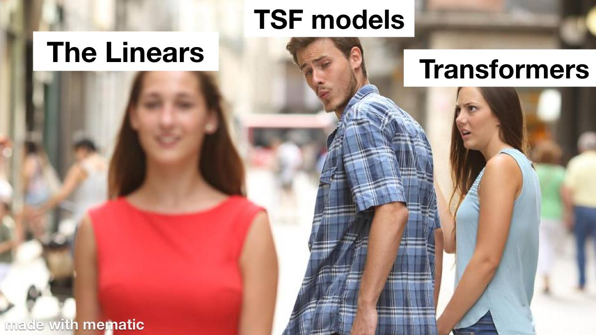

<div align="center">
  <h2><b>SuperLinear: Foundation Time Series Forecasting</b></h2>
</div>

<div align="center">
  
[](https://opensource.org/licenses/MIT)


</div>

<div align="center">
  
**[<a href="https://github.com/your-username/timeseer">GitHub</a>]**
**[<a href="https://your-docs-url.com">Documentation</a>]**

</div>

<p align="center">
  
</p>

> 1️⃣ TimeSeer provides a **comprehensive foundation** for time series forecasting that combines state-of-the-art statistical models, machine learning techniques, and deep learning approaches.

> 2️⃣ Supports **multiple forecasting models** including ARIMA, Exponential Smoothing, Prophet, LSTM, and Transformer-based architectures.

## TODO List
- [ ] Add support for multivariate time series
- [ ] Implement Prophet and Transformer-based models
- [ ] Add interactive visualization dashboards
- [ ] Enable GPU acceleration for neural models

## Updates/News:

🚩 **News** (April 2025): Super Linear v1.0.0 has been released!

🚩 **News** (March 2025): 

🚩 **News** (February 2025): 

## Introduction


<p align="center">
  
</p>


## 🚀 Getting Started

### Installation

1. Clone the repository
```bash
pip install -r requirements.txt
```

## 📈 Making Forecasts
```typescript
import torch
from transformers import AutoConfig, AutoModelForCausalLM


device                   = torch.device('cuda' if torch.cuda.is_available() else 'cpu')
batch, seq_len, channels = 4, 512, 3  # channels should match your model's expected input channels
series                   = torch.randn(batch, seq_len, channels, dtype=torch.float32).to(device)
torch.manual_seed(42)

# Use the config when loading the model
model = AutoModelForCausalLM.from_pretrained('razmars/SuperLinear',
                                             device_map=device,
                                             torch_dtype='auto',
                                             trust_remote_code=True,
                                             force_download=True)

with torch.no_grad():
    output = model(inputs_embeds=series)
    preds  = output.logits                

```

## Evaluation

## 🔥 Fine-tuning 
just cheking

## 📚 Citation

If you use TimeSeer in your research, please cite:

```
@software{timeseer2025,
  author = {Your Name},
  title = {TimeSeer: Foundation Time Series Forecasting},
  year = {2025},
  url = {https://github.com/your-username/timeseer}
}
```

## Related Resources
* Transformers in Time Series: A Survey, IJCAI 2023. [paper](https://arxiv.org/abs/2202.07125)
* Self-Supervised Learning for Time Series Analysis: Taxonomy, Progress, and Prospects, TPAMI 2024. [paper](https://arxiv.org/abs/2306.10125)
* Foundation Models for Time Series Analysis: A Tutorial and Survey, KDD 2024. [paper](https://arxiv.org/abs/2403.14735)

## Acknowledgments

- Inspired by Facebook's Prophet and other open-source forecasting libraries
- Thanks to all contributors who have helped shape this project
- Special thanks to the research community for advancing the field of time series forecasting

## License

This project is licensed under the MIT License - see the LICENSE file for details.