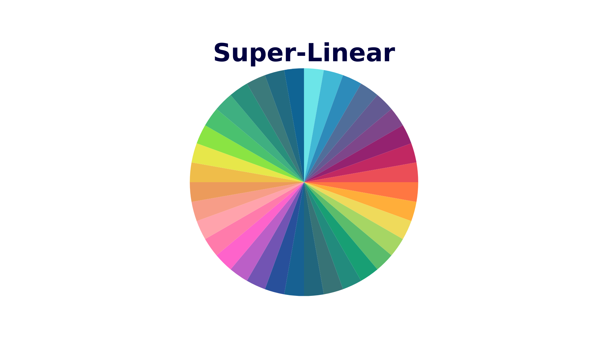

<div align="center">
  <h2><b>Super-Linear: A Lightweight Pretrained Mixture of Linear Experts for Time Series Forecasting</b></h2>
</div>

<div align="center">
  
[](https://opensource.org/licenses/MIT)


</div>

<div align="center">
  
**[<a href="https://github.com/azencot-group/SuperLinear">GitHub</a>]**
**[<a href="https://your-docs-url.com">Documentation</a>]**

</div>

<p align="center">
  
</p>

> Super Linear provides a **comprehensive foundation** for time series forecasting achieveing competitive performance against more complex models
with an efficient architecture combine mixture of frequencies linears experts.


## TODO List
- [ ] Add support for other time series tasks as: probabilistic forecasting, Classifiction, Annomaly ditaction etc'
- [ ] Fine Tuning on specific lookback and horiozn
- [ ] Train from Scratch

## Updates/News:

🚩 **News** (July 2025): Super Linear v1.0.0 has been released!


## Introduction


<p align="center">
  
</p>


## 🚀 Getting Started

### Installation

1. Clone the repository
```bash
pip install -r requirements.txt
```

## 📈 Making Forecasts (Hugging Face)
```typescript
import torch
from transformers import AutoModelForCausalLM


device                   = torch.device('cuda' if torch.cuda.is_available() else 'cpu')
batch, seq_len, channels = 4, 512, 3  # channels 
series                   = torch.randn(batch, seq_len, channels, dtype=torch.float32).to(device)
torch.manual_seed(42)

model_path = 'SequentialLearning/SuperLinear'
model = AutoModelForCausalLM.from_pretrained(model_path,trust_remote_code=True, force_download=True).to(device)

with torch.no_grad():
    output = model(inputs_embeds=series)
    preds  = output.logits              

```
## 📈 Making Forecasts (Local)
```typescript
from utils.args import get_args
from models.SuperLinear import Model
import numpy as np
import torch

args = get_args(notebook=True)
for key, value in args.__dict__.items():
    print(f"{key}: {value}")

seq_len = 512
pred_len = 96

freq = 1/48
amp = 1
ph = 0

t = torch.arange(0, seq_len+ pred_len)
s = amp * torch.sin(2 * np.pi * freq * t + ph)
x = s[:seq_len].unsqueeze(0)  # Add batch dim
y = s[seq_len:].unsqueeze(0)  # Add batch dim

super_linear = Model(args)
super_linear.eval()

out, prob = super_linear(x, pred_len=pred_len,  get_prob=True)
```
## Evaluation

+ [Example] Running the follow command to evaluate on ETTh1.

```shell
python run_eval.py -d dataset/ETT-small/ETTh1.csv -p 96
```


## 🔥 Fine-tuning 

⏳ In progress

## 📚 Citation

> todo

```
@misc{shi2024timemoe,
      title={Time-MoE: Billion-Scale Time Series Foundation Models with Mixture of Experts}, 
      author={Xiaoming Shi and Shiyu Wang and Yuqi Nie and Dianqi Li and Zhou Ye and Qingsong Wen and Ming Jin},
      year={2024},
      eprint={2409.16040},
      archivePrefix={arXiv},
      url={https://arxiv.org/abs/2409.16040}, 
}
```
## Related Resources
* Time-Moe: Billion-Scale Time Series Foundation Models with Mixture of Experts, in ICLR 2025. [\[paper\]](https://arxiv.org/abs/2409.16040) [\[GitHub Repo\]](https://github.com/Time-MoE/Time-MoE)
* Foundation Models for Time Series Analysis: A Tutorial and Survey, in *KDD*
  2024. [\[paper\]](https://arxiv.org/abs/2403.14735) [\[Tutorial\]](https://wenhaomin.github.io/FM4TS.github.io/)

## Acknowledgments

We appreciate the following GitHub repos a lot for their valuable code and efforts.
- Time-Moe [\[repo\]](ttps://github.com/Time-MoE/Time-MoE)
- Time-Series-Library [\[repo\]](https://github.com/thuml/Time-Series-Library)


## License

This project is licensed under the MIT License - see the LICENSE file for details.